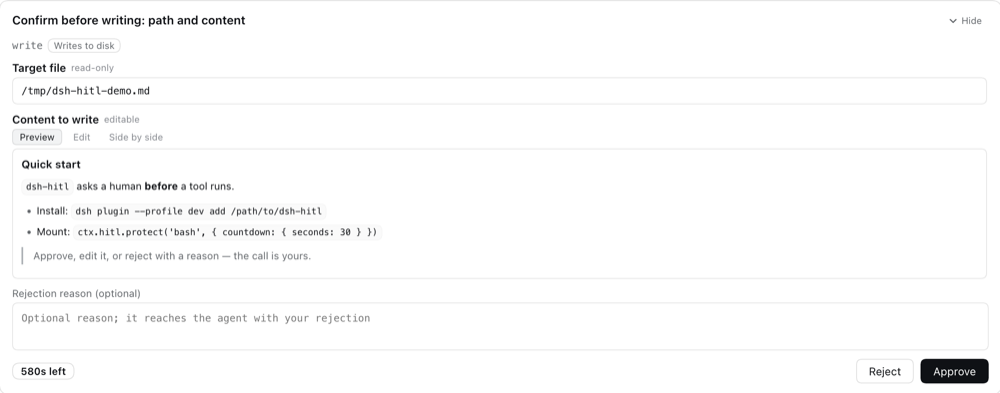
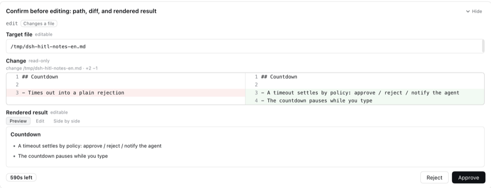
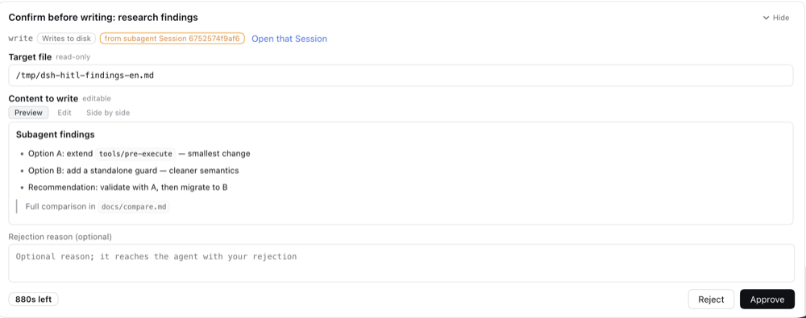
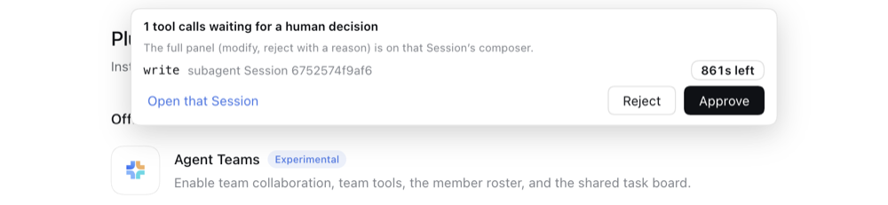

# dsh-hitl · Human-in-the-loop for any tool

English | [中文](README.zh.md)

> **Let the agent ask you before it acts.**
> One config entry or one API call turns any tool call into a card that waits for your nod: read what it is about to do, then approve it, edit it, or reject it with a reason.

`dsh-hitl` is an installable DeepSeek Harness (DSH) plugin (bundle): **zero dependencies, zero build** — `index.js` (host half) + `client.js` (browser half) + `lib/` are plain JS that loads as it is. Install it, refresh the page once, and it works.



## Features

- **Mount with one line**: another tool or plugin puts its own tools behind HITL with one API call or one config entry;
- **A decision card before execution**: before the tool really runs, the DSH Web UI shows **a title + the pending proposal + decision buttons**;
- **Several ways to render a proposal**: **side-by-side diff (read-only)**, **plain text input**, **editable and rendered markdown input** — and text and markdown fields can each be presented read-only or editable;
- **Modify mode**: once you edit proposal text, the primary button turns from 【Approve】 into 【Modify】 — your edit goes back to the agent as a revision request;
- **Rejection with feedback**: 【Reject】 can carry a **feedback box**, and what you write there reaches the agent together with the rejection — it knows "don't do it" *and* "why not";
- **Configurable countdown**: a **countdown** plus three endings (**approve automatically / reject automatically / report the timeout to the agent**).



## Made for DSH

**Subagent pass-through: a tool call inside a subagent raises its approval request in the main conversation too.** Every tool call inside an in-process subagent (`spawn` / `fork`) goes through the same gate — the request is filed **both** under the child Session that made it and under the Session you are currently looking at: whichever conversation you are in, the card can appear there, labelled 「from subagent Session xxx」 with an 【Open that Session】 button.
(Out-of-process backends never reach this gate — see §6.1.)



**A mini approval request even when you are not in a conversation.** Switch to the plugins page, open settings, or select no Session at all, and a notice floats at the top of the page, so HITL does not have to block the run while you are elsewhere (count, tool name, source Session, remaining time + 【Approve】【Reject】【Open that Session】).



---

## 1. Install

```sh
# Straight from GitHub (nothing to build)
dsh plugin --profile <your profile> add github:YunpengDon/dsh-hitl

# From a local directory (handiest while developing: restart dsh after code changes)
dsh plugin --profile <your profile> add /path/to/dsh-hitl

# Or through the GUI: Settings → Plugins → install bundle
```

Once installed:

1. **Refresh the page once** (important). The plugin's token reaches the page through the index injection (`window.__DSH_HITL__`). A page that was already open cannot see it, even after the browser half is hot-reloaded — so the first install needs one refresh; later restarts do not.
2. Either list the tools you want to protect in the `hitl` row of `cordis.patch.yml` (next section), or let other plugins call `ctx.hitl.protect(...)`.

> Uninstall: `dsh plugin --profile <profile> remove dsh-hitl` (its configuration layer is removed with it).

---

## 2. Thirty-second start

### 2.1 Option 1: through configuration (the target tool keeps its code)

`cordis.patch.yml`:

```yaml
- id: hitl
  name: 'dsh-hitl'
  config:
    protect:
      - tool: bash                      # tool name; patterns like 'mcp__*' work too
        title: 执行命令前确认            # panel title (bold, wraps)
        countdown: { seconds: 30, action: reject }
        reject: { feedback: true }      # show the feedback box on reject
```

> A patch that overrides a row replaces its **whole config**: restate every key you still want.

### 2.2 Option 2: mount HITL from the target plugin's own code

```js
export const name = 'my-plugin'
export const inject = ['hitl']            // wait for the hitl service before applying

export function apply(ctx) {
  // Passing your own ctx as the third argument binds the mount to this plugin's lifetime
  ctx.hitl.protect('bash', {
    title: '这条命令要执行吗？',
    countdown: { seconds: 30, action: 'reject' },
    reject: { feedback: true },
  }, ctx)

  ctx.hitl.protect(['write', 'edit'], {   // arrays, globs, RegExp, and predicates all work
    title: '改动前确认',
    diff: { path: 'file_path', before: 'old_string', after: 'new_string' },  // folded into a side-by-side diff
    countdown: null,                     // no countdown = wait forever (still cancellable)
  }, ctx)
}
```

> **Always pass `owner` (the third argument).** Mounts are state owned by the `hitl` plugin, not by yours. Without an owner, the disposer `protect()` returns is the only way to unbind — and "return a function from `apply`" is **not** a lifetime: it was measured that the mount outlives the unloaded plugin row, leaving that tool blocked forever. With `ctx`, `hitl` registers an effect on your plugin's context and the mount is released when your plugin unloads. The equivalent explicit form is to wrap it in your own effect: `ctx.effect(() => ctx.hitl.protect('bash', {...}), 'my-plugin: hitl mount')`. If a mount does linger, look at `ctx.hitl.list()` and clear it with `ctx.hitl.unprotect('bash')`, or toggle the `hitl` row off and on in the plugins page (which rebuilds the plugin's state).

### 2.3 Service API

| Member | Purpose |
|---|---|
| `protect(matcher, options?, owner?)` | Mount one tool; pass the caller's ctx as `owner` for automatic unbinding; returns a disposer |
| `unprotect(matcher)` | Remove the mounts a matcher describes; returns how many were removed |
| `list()` | Every current mount (diagnostics) |
| `pending()` | Every request currently waiting for a human (diagnostics) |

`matcher`: a tool name / a glob string containing `*` / a `RegExp` / an array of those / `(exec) => boolean`.
When one tool is mounted several times, **the most recent mount wins** (the config row registers first and plugins later — so a plugin can override the config).

---

## 3. Default proposal rules

Without `fields`, the proposal is **every parameter of this call**:

- field title = the parameter key (or the schema's `title` when the tool schema provides one);
- field value = the parameter value, **rendered as a markdown input in every case** (non-string values arrive as pretty-printed JSON text);
- editability: `markdown` / `text` are editable by default; `diff` / `json` / `hidden` are always read-only;
- when the arguments are an empty or non-object value (a single scalar parameter, say), the panel shows one read-only `(arguments)` field;
- the panel title defaults to `Confirm how <toolName> runs` (and follows the interface language).

---

## 4. Mount options (`protect()`'s second argument / each entry of the config row)

| Key | Type | Default | Purpose |
|---|---|---|---|
| `tool` / `matcher` | string \| RegExp \| array \| function | required | The tools to protect |
| `title` | string | see §3 | Panel title (bold, wraps) |
| `layout` | `stacked` \| `split` | `stacked` | Proposal layout: stacked vertically / side by side |
| `labels` | string[] | `[]` | Panel-level labels (zero or more) |
| `buttons` | `{approve?, modify?, reject?}` | follows the language | Button copy overrides |
| `fields` | `FieldSpec[]` | all parameters | Which parameters to show, and how |
| `diff` | `{path?, before, after}` | none | Fold two parameters into one read-only side-by-side diff |
| `countdown` | `{seconds, action, freezeOnInteract?}` \| `null` \| `false` | `null` | Countdown and timeout behaviour; `null`/`false` = no deadline |
| `reject.feedback` | boolean | `false` | Whether to show the rejection feedback box |
| `reject.feedbackPrompt` | string | built-in copy | Feedback box placeholder |
| `reject.requireFeedback` | boolean | `false` | Feedback is required (an empty box is refused with a hint) |
| `modify.mode` | `revise-request` \| `allow-and-inform` | `revise-request` | What 【Modify】 means after an edit; see §5 |
| `whenUnavailable` | `reject` \| `wait` | `reject` | Behaviour with no browser connected (`reject` = fail-closed) |
| `enabled` | boolean \| `(exec) => boolean` | `true` | Turn a mount off temporarily / make it conditional |
| `maxFieldChars` | number | `20000` | Per-field render cap; longer values are truncated with a note |

### FieldSpec

```js
{ param: 'content', title: '新内容', description: '会写入文件的内容',
  render: 'markdown',        // markdown | text | diff | json | hidden
  editable: true,            // overrides the default editability
  labels: ['不可撤销'],       // field-level labels
  diff: { before: 'old_string', after: 'new_string', path: 'file_path' } }   // used when render: 'diff'
```

- With no `render`, a field renders as a diff when one can be configured, and as a markdown input otherwise.
- When `fields` is given, **only** the listed fields are shown (parameters you leave out never reach the panel).
- Config rows may shorten a spec to a bare string: `fields: ['command', { param: 'cwd', title: '工作目录' }]`.

### The three endings of a countdown

`countdown.action` decides what the host does when the countdown reaches zero:

| action | Does the tool run? | What the agent sees |
|---|---|---|
| `approve` | yes | nothing extra (the tool returns normally) |
| `reject` | no | `Error: HITL: no human decision arrived within Ns, so tool "x" did not run (timeout policy: reject).` |
| `notify` | no | `Error: HITL: no human decision arrived within Ns, so tool "x" did not run. Tell the user this call timed out and wait for an explicit instruction before running it.` |

`freezeOnInteract` (default `true`): as soon as the human focuses or edits any input, the client asks the host to **pause the countdown**; blurring resumes it. A pause has a ceiling (the plugin's `holdGraceMs`, 5 minutes by default) so that closing the page cannot block a tool forever.

A timeout is not a decision the human made, so the panel **does not vanish the instant it fires**: it stays for about five seconds with the countdown chip switched to "timed out; the host is settling it", the buttons and inputs greyed out, and a "settled by the timeout policy" note — then it closes. (Otherwise the card would simply disappear mid-read.) The three buttons the human presses himself close it immediately.

---

## 5. Decision semantics (what you press, what the agent receives)

| Human action | Does the tool run? | What the agent receives |
|---|---|---|
| 【Approve】 | yes | the tool's normal result |
| 【Modify】 after an edit (default `modify.mode: revise-request`) | **no** | `Error: HITL: the user revised the proposal, so tool "x" did not run. Re-issue the call with these changes:` + `- param: new text` for every changed field |
| 【Modify】 after an edit (`allow-and-inform`) | yes | the tool's normal result + one user message right after it carrying the edited text |
| 【Reject】 | no | `Error: HITL: the user rejected tool "x" and it did not run.`; with feedback filled in, `… User feedback: <verbatim>` |
| timeout / no decision surface / request withdrawn | see §4 and §7 | the matching copy above; a withdrawal returns DSH's canonical cancellation result |

> **Why doesn't 【Modify】 run the tool by default?** DSH does not allow rewriting a tool's arguments before execution
> (`PreToolDecision` only has `allow` / `deny` / `cancel` / `ask`; argument rewriting is still a proposed design).
> So "modify" hands the edited text **back to the agent**, which re-issues the call with the new arguments — the most
> honest semantics, and the session log stays consistent. If your tool can accept "run now, be told about the edit later"
> (a recorder or a display, say), set `modify.mode` to `allow-and-inform`.

Every rejection/revision message carries the `HITL:` prefix so it is easy to find in a session log; the error codes are
`HITL_REJECTED` / `HITL_REVISED` / `HITL_TIMEOUT` / `HITL_UNAVAILABLE`.

---

## 6. Panel behaviour

- **Where it lands**: the composer seat of the Session — the same place DSH's own approval and question panels use, which is where "the agent is stuck waiting for you" already lives.
- **Collapse**: the hide/show control beside the title folds **the whole proposal** away, leaving the title, the countdown, and the decision buttons (the glyph follows the direction it will move: ∨ when expanded, ∧ when collapsed), so the panel never hides the conversation above it. The preference is **remembered**: collapse once and later requests start collapsed. Pressing 【Reject】 while collapsed on a mount with a feedback box expands the panel first and focuses the box, so your words are never lost.
- **Priority**: a HITL decision outranks the approval and question panels; when one Session has several pending decisions, **the earliest is shown**, and the panel notes "N more waiting" in the corner.
- **Countdown**: it sits **at the left of the action row** (the same row as 【Reject】【Approve】, pushed fully left) as a **deliberate chip** rather than faint grey text: solid and bold with tabular figures normally, warning colour with a slight pulse under ten seconds (honouring `prefers-reduced-motion`), muted while paused, error-coloured with "timed out; the host is settling it" past zero. Buttons disable at zero, the panel lingers about five seconds with the "settled by the timeout policy" note, and only then closes.
- **The countdown is always the host's number**: every frame (a new request, a reconnect snapshot, a resend after a client hot-reload) carries the remainder the host computes **at that moment** (the host half's `liveRequest()` projection plus a client that re-bases its clock on every delivery). Refreshing the page, switching tabs, or hot-reloading therefore cannot make the countdown "jump back to full", and "the panel says ten seconds left while the host already timed out" cannot happen.
- **Interacting pauses it**: focusing or editing any input asks the host to **freeze the countdown**, and only shows "paused while you edit" once the host agrees — the label agrees with the host's clock and the remainder really stops. Blurring resumes it, bounded by `holdGraceMs` (5 minutes by default). After a reconnect the host's snapshot carries `countdown.held`, so a refresh cannot leave the panel pretending to be paused.
- **Markdown fields**: they **open on the rendered preview** (a decision panel is read before it is edited; the source is second-class information), with `preview / edit / side by side` views. The renderer is a controlled subset written into this plugin (headings, lists, quotes, fenced code, inline code, bold/italic, links, rules, paragraphs) and inline code follows the host's markdown tokens (`--dsw-alias-markdown-inline-code`, `--ds-font-family-code`). **Text is escaped before any tag is emitted**, so HTML in the source stays text, and link targets such as `javascript:` are dropped.
- **The field header states what the control can do right now**: the small label beside a field title reads "editable / read-only" and comes from **the same predicate the render area uses** (`isFieldEditable`) — a field may claim `editable: true`, but while the panel is submitting, settled, or expired the render area is already a read-only block and the label says "read-only" with it. "Labelled editable but impossible to click" cannot happen.
- **Read-only fields**: a field with `editable: false` **never** renders as an input — `text` becomes a block, and `markdown` keeps `preview / side by side` with **no edit tab**, labelled "read-only". The source pane in side-by-side mode is a **selectable, copyable block**, not a `disabled` input: text inside a disabled field can be neither selected nor copied in a browser, which would display content while refusing to hand it over.
- **Inputs grow with their content**: a single line occupies one line of height, the box grows as you type, and past 320px it scrolls internally instead of filling the panel with blank space. The growth happens **before paint** (a layout effect); doing it after would expose one frame of a one-line box, shrink the proposal area, and let the browser clamp the scroll position back to the top.
- **Switching views keeps your place**: 【Edit】/【Preview】/【Side by side】 record the proposal's scroll anchor before the switch and restore it before paint, so a long proposal does not jump back to the top.
- **Diff fields**: read-only, two panes, aligned line numbers, with `--dsw-alias-code-diff-added` / `-deleted` colouring. When either side exceeds 2000 lines the panel stops aligning and shows both texts side by side with a note.
- **Several windows**: every open tab receives the same request; **the first decision wins**, and the other tabs drop the panel when the settled frame arrives.
- **Refresh / reconnect**: the host sends one snapshot on reconnect, so pending decisions come back and nothing is lost.
- **Styling**: only DSH theme tokens (`--dsw-alias-*`), so it follows light and dark themes; the panel carries an error boundary and degrades to one line of text instead of blanking the composer.

### 6.1 Where a subagent call lands

A tool called by a subagent **is gated too** (in-process subagents, see the table below), but that call happens inside a **child Session**, and a pending decision in DSH is owned **per Session**: a panel only takes over the composer of the Session you are looking at. The plugin therefore files every request **twice**:

| Filing | What it buys |
|---|---|
| The Session that made the call | Open that subagent's conversation (the subagent card in the transcript → open the child Session) and the panel is there |
| **The Session you are looking at** | Wherever you are, the panel appears in the composer in front of you, labelled 「from subagent Session 4e05464d5b7d」 with an 【Open that Session】 button |

- Both filings are **one request**: deciding in either place settles the one call, first answer wins, and the panel's "N more waiting" counts every pending request.
- Switch Sessions and the follow-along filing moves with you (the client subscribes to the host's main-view binding source); no page refresh needed.
- Why this is necessary: the status dot on a session row only knows the built-in kinds `approval / plan-review / question`, and this plugin's `kind: 'hitl'` is not one of them — so **the child Session's row shows no dot at all**. Without the follow-along filing, a subagent's gated call would silently wait until its countdown ends.

**Does it trigger?** (measured once on a local profile)

| Subagent backend | Gated? | Why |
|---|---|---|
| `spawn` / `fork` (in-process, `subagent-in-process-driver`) | **yes** | The child is another agent in the same process and the tool pipeline is the same one; this plugin's listener carries no agent scope tag, and `scopeTarget` admits untagged listeners for every key |
| `dsh-sdk` / `acp` / `claude-code` / `codex` (out of process) | **no** | Their tool calls happen in **another process** and never pass DSH's `tools/pre-execute`; only the `subagent` **call itself** can be gated |

**What happens after it triggers**: the subagent's call stops at the gate (its turn stalls), the parent's `subagent` call is waiting on the child, and **the whole conversation stalls with it** — what you see on screen may just be "the subagent is still running". You can answer in the panel while you wait; on timeout the mount's `countdown.action` settles it and the child receives a tool error shaped like

```
Error: HITL: no human decision arrived within 75s, so tool "glob" did not run. Tell the user this call timed out and wait for an explicit instruction before running it.
```

(with `error: {name:'HitlTimeout', code:'HITL_TIMEOUT'}` on the event), after which the child decides whether to report or retry. **Give any mount a subagent might call a `countdown`**: without one it waits forever, and nobody is there to click for the child.

### 6.2 Frame-level fallback notice (`shell.overlay`)

The composer seat is not the same thing as "visible": with no Session selected, with another main panel (the plugins page) on screen, with a higher-precedence shipped panel holding the composer, **or covered by a full-viewport modal** (the settings dialog is one — a `body` portal at `z-index:1000` that leaves the conversation and its composer **mounted behind it**) — each of those needs another landing spot. So the plugin registers one more **root-scoped overlay** (`dsh-hitl.notice` in `shell.overlay`, registered additively, replacing nothing):

- It appears when there is a decidable request **and** (there is no composer seat **or** the seat's panel can no longer be reached). "Cannot be reached" is **measured by the panel itself once a second** with a hit test (`document.elementFromPoint` landing outside the panel = covered, clipped, or scrolled out of view) rather than guessed from Session state; the moment the panel is really in front of you, the notice yields — the two never show the same request twice.
- **Visible even when covered**: the notice promotes itself to the browser's **top layer** with `popover="manual"` + `showPopover()`, so even a `z-index:1000` modal cannot hide it (where the API is missing it degrades to fixed positioning inside the shell overlay, and a modal can cover it again).
- It shows the count, the tool name, the source (this Session / a subagent Session) and the host's countdown; at most three rows, the rest folded into "N more".
- It offers the two decisions that need no editing — 【Approve】【Reject】 — plus 【Open that Session】. Modify and reject-with-a-reason stay in the Session panel.
- It wraps itself in an error boundary and **renders null** on failure: a surface painted over the whole frame must be able to disappear, not leave an empty box behind.

### 6.3 Interface language

The panel follows the **application's current language** — not the mounting plugin's, and not a hard-coded Chinese:

- **Where the language comes from**: first the user's choice in Settings → General → Language (persisted in DSH settings, so it survives a different browser); with no choice, the browser decides — the first tag in `navigator.languages` that matches a **registered** language (an exact id first, then the primary subtag, so `zh-CN`, `zh-TW`, and `zh-Hans` all resolve to `zh`); with no match, **English** (DSH's `FALLBACK_LOCALE`, on the grounds that a reader who named no registered language is the least likely to read Chinese). In short: **a Chinese browser gets a Chinese panel; every other language (Japanese, German, French, …) gets English.**
- **Per-key fallback chain**: the active language's dictionary → each language's declared `fallback` (language packs) → `en` → the shared namespace → and only then **the key itself**. This plugin's `zh` and `en` dictionaries carry **identical key sets** (locked by a test), so a key can never leak; even with a third language pack installed (a Japanese UI, say), this plugin's copy lands on **English** rather than printing `label.countdown`.
- **Switching language takes effect immediately**, no page refresh (the slot locale binding and dictionary registration both advance the revision, and rendered seats re-read their copy).
- **The plugin list's name and description** travel a different DSH path: `locale/<language>.json` inside the package, shaped `{"meta":{"title":…,"description":…}}`, with `./locale/*.json` in `exports` and `locale` in `files`. Miss any of those and the card title silently falls back to the package name `dsh-hitl` (a test in this repository watches for exactly that).
- **What is never localized**: `protect()`'s `title`, its `labels`, and every field `title`/`description` (that is the mounting plugin's own copy), the tool name, and the **raw argument values** in a proposal. Bilingual titles would have to be passed as separate strings per language by the mounting plugin.
- **Host-half text aimed at the model is always English** (rejection reasons, timeout notices, revision notes), matching every other DSH pre-execution policy — it enters the model's context, not a human's interface.

---

## 7. Security model and fail-closed

- Panel and host talk over **this plugin's own same-origin HTTP channel**: `GET <endpoint>/events` (SSE downlink, delivering a snapshot on connect) + `POST <endpoint>/decide` (JSON uplink). The default `endpoint` is `/dsh-hitl`.
- The channel is protected by **one random token per process**, delivered through DSH's structured index-injection row (`webserver/index-inject`, `{kind:'global'}`) into the page's `window.__DSH_HITL__`; it is never logged and never written to disk.
- The server also checks that the request comes from a loopback address, that a POST carries `content-type: application/json` and (when present) an `Origin` matching the Host, that the body stays under 256 KiB, and compares tokens with `timingSafeEqual`. Those checks stop *other web pages on the machine* (CSRF / DNS rebinding), not local processes — a local process can read `~/.dsh` anyway.
- **With no browser connected the default is fail-closed**: a tool mounted behind HITL is rejected and the model sees `Error: HITL: no browser is connected to decide, so tool "x" did not run (fail-closed).` Set `whenUnavailable` to `wait` if it should wait forever in unattended runs instead.
- In a composition with no Web service at all (headless/TUI) the plugin **stays active and keeps gating** — "no UI, therefore no gate" is not this plugin's semantics.

---

## 8. Relationship to other pre-execution policies

- This plugin listens on `tools/pre-execute` with `prepend: true`, i.e. **ask the human first**; once the human agrees, the sandbox, guards, hooks, approval, and every other policy still run afterwards. **A human's approval is not a privilege escalation.**
- So "the human approved but the sandbox or a guard still refused" is by design, not a bug.
- This plugin only asks before execution: it never rewrites a tool's arguments and never rewrites a tool's result.

---

## 9. Known limitations

- **Tool arguments cannot be rewritten** (see §5), so 【Modify】 defaults to "refuse and hand the edit back".
- **Mount copy is not localized**: `title` / `labels` / field titles are strings the mounting plugin supplies; this plugin does not translate them and does not accept a `{zh, en}` map (see §6.3).
- **No session audit event**: DSH does not let a plugin append new event types, so the decision trail lives only in the tool result (and, under `allow-and-inform`, in one user message).
- **Only the Web UI has a panel**: under ACP/TUI/headless the mount's `whenUnavailable` decides (reject by default).
- **Only a same-origin Web deployment** (page and plugin routes on the same `dsh web` address); the Desktop worker form is unverified.
- The user message under `allow-and-inform` is built by hand in the shape of `createUserMessage` (`{id, role:'user', source:{kind:'user'}, content}`), because a plain-JS plugin cannot import host factories.
- The panel registers no global shortcuts (so it never steals the host's Enter/Esc); click the buttons.
- **Out-of-process subagents are outside this plugin's reach** (see §6.1): tool calls inside the `dsh-sdk` / `acp` / `claude-code` / `codex` backends never pass `tools/pre-execute`; only the `subagent` call itself can be gated.
- **The frame-level notice is not the full panel**: it offers 【Approve】/【Reject】 only (without a reason); modify and reject-with-a-reason need the Session panel.
- **A subagent request makes the parent wait too**: nothing this plugin can change — the parent is waiting for the child, and the child is waiting for your decision.

---

## 10. Troubleshooting

| Symptom | Cause / what to do |
|---|---|
| The tool is rejected outright with `no browser is connected to decide` | The page is not on the decision channel: **refresh the page once** after installing, and confirm the browser console shows no 401 |
| The panel never appears and the tool just hangs | The request belongs to a Session you are not looking at. The plugin also files it under the Session you *are* looking at (§6.1), so this should not happen; if it does, look for the frame-level notice (§6.2) or switch to the asking Session |
| A subagent's call is left hanging, or a subagent stalls the whole conversation | Expected: an in-process subagent's call really is gated, and the parent waits with it (§6.1). Give it a `countdown`, or answer in the panel/notice |
| A tool inside an out-of-process subagent is not gated at all | Expected (§6.1): those tools run in another process and never pass `tools/pre-execute` |
| No dot on the child Session's sidebar row | Expected: DSH's row status dot is a compile-time closed set (`approval/plan-review/question`) and this plugin's `kind: 'hitl'` is not in it. Use the composer panel or the frame-level notice |
| `countdown` seems to do nothing | Check that `seconds` is a positive integer and `action` is one of the three values; an invalid config logs a `dsh-hitl:` warning on the host and degrades to "no deadline" |
| A config change does nothing | A patch replaces the **whole config** of the row it overrides; confirm the `id: hitl` row still carries every key |
| The plugin is installed but the host half never starts | Check dsh's stderr: a row that fails to load does not exit dsh, and the log carries `dsh-hitl: ...` or the row id |
| Behaviour does not change after upgrading the plugin | Replacing an installed package needs **a dsh restart** (the plugin manager does not swap a new version in place) |
| Behaviour does not change after editing plugin code | The **browser half** (`client.js`) is picked up by client hot-reload; the **host half** (`index.js`, `lib/`) sits behind Node's ESM module cache, so `disable → enable` on that row does **not** reload the code — **restart dsh** |
| See the host state at a glance | `curl -s http://127.0.0.1:3081/dsh-hitl/status` (loopback only, no token, read-only): connected browsers, tokens issued by this process, mounted tools, and the pending list with live remaining milliseconds and hold state. It carries no token and no tool arguments |

Host-half diagnostics all carry the `dsh-hitl:` prefix (invalid mounts, dropped connections, refused channel requests).

---

## Appendix · Protocol (if you want to write your own UI)

Downlink (SSE, `data: <json>`):

```jsonc
{ "type": "snapshot", "version": 1, "requests": [Request, ...] }   // sent on connect
{ "type": "request", "version": 1, "request": Request }            // a new pending decision
{ "type": "settled", "version": 1, "id", "outcome": "user|timeout|abort|host" }
{ "type": "holdAck", "version": 1, "id", "held": true, "expiresAt": 1712 }
```

`Request`:

```jsonc
{ "id", "sessionId", "toolName", "callId?", "title?", "layout", "labels": [],
  "fields": [ { "param", "title", "description?", "render", "editable", "labels": [],
                "value"?, "truncated"?, "diff"? { "path?", "oldText", "newText" } } ],
  "buttons": { "approve"?, "modify"?, "reject"?, "feedback": { "enabled", "prompt"?, "required" } },
  "countdown": { "remainingMs", "action", "freezeOnInteract" } | null,
  "createdAt" }
```

Uplink (`POST <endpoint>/decide`, `Authorization: Bearer <token>`):

```jsonc
{ "type": "decide", "id", "decision": { "kind": "approve" } }
{ "type": "decide", "id", "decision": { "kind": "modify", "fields": [{ "param", "text" }] } }
{ "type": "decide", "id", "decision": { "kind": "reject", "feedback"?, } }
{ "type": "hold",   "id", "held": true }
```

Reply: `{ ok: true, accepted: true, held?, expiresAt? }` or
`{ ok: false, code: "unauthorized|bad-payload|unknown-request|already-settled|host-gone", message }`.

---

## Appendix · File structure

```text
dsh-hitl/
├── index.js                629   host half: service + gate + countdown/hold + SSE & decision routes + token injection
├── client.js              1918   browser half: decision panel + frame-level notice (self-contained classic script, no imports)
├── lib/                          the host half's pure logic: no Cordis, no DOM, testable on its own
│   ├── protocol.js         182   frame and uplink validation, limits, error codes (the single source of the protocol)
│   ├── resolve.js          302   matcher compilation (name/glob/RegExp/predicate), option normalization and diagnostics
│   ├── fields.js           244   default proposal derivation, diff pairing, decision → model-visible text
│   └── pending.js          217   the pending-decision state machine (injectable clock): countdown, hold, settle-once
├── locale/                       the plugin list's name and description (shape must be {"meta":{...}}, see §6.3)
│   ├── en.json               6
│   └── zh.json               6
├── docs/                         the screenshots shown above, one set per language (-en / -cn)
├── tests/                        zero-dependency Node tests, 151 cases in total
│   ├── client.test.js      818   (65) the browser half's pure helpers + store / connection / seat
│   ├── fields.test.js      269   (26) proposal derivation and decision text
│   ├── pending.test.js     240   (18) the state machine (injected clock, no real waiting)
│   ├── resolve.test.js     162   (18) matchers and option normalization
│   ├── protocol.test.js    117   (16) frame and uplink validation
│   ├── docs.test.js        116   (5) the two READMEs, their links, and the numbers in this very table
│   └── manifest.test.js     61   (3) package metadata and the locale resource shape
├── package.json             69   manifest: exports / dsh.bundle.patch / dsh.client / icon
├── cordis.patch.yml         17   the bundle's configuration layer (inserts the row with id `hitl`)
├── icon.svg                  6   the plugin list icon
├── README.md                     this document
└── README.zh.md                  the Chinese twin of this document
```

**Which file to edit, and how a change takes effect** (the same rule as the §10 table):

| File | Half | How a change takes effect |
|---|---|---|
| `index.js`, `lib/*.js` | host half (Node) | **restart dsh**. Node's ESM module cache is not invalidated by "disable → enable on that row" |
| `client.js` | browser half | **client hot-reload** picks it up (the host stats each row's client artefact every 500ms and broadcasts over `/plugins/events`); no page refresh needed |
| `locale/*.json` | plugin-list metadata | when the plugin manager re-reads metadata (opening the plugins page / restarting dsh) |
| `docs/*.png` | documentation | when the README is rendered |
| `package.json`, `cordis.patch.yml` | manifest and config layer | a restart or a reload of that row; an installed package is not swapped in place |
| `tests/*.js` | development | never runs in production; executed by `npm test` / `node --test` |

**Why it is shaped this way** (three constraints worth reading before changing code):

- `client.js` **must** be a self-contained classic script. DSH serves it verbatim as `/plugins/dsh-hitl/client.js`, its entry point is fixed at `window.__ModuleLoader__.load({ id, factory(require) })`, it may take `react` from the module table, and it **must not** import any `@deepseek-ai/*` client package (no bundling step will resolve them). That is why the markdown renderer, the side-by-side diff, the countdown, and the panel styles all live in that one file, with CSS built from `--dsw-*` theme tokens only.
- `lib/` holds pure modules for the host half alone. The browser half **cannot** require them, and they pull in neither Cordis nor HTTP — which is what lets `node --test` run each of them directly, with protocol and state-machine behaviour that does not depend on the runtime.
- The pure logic in `client.js` reaches the tests through the `__test` key of the factory's return value: `tests/client.test.js` loads the **real** `client.js` behind a stub `window.__ModuleLoader__` and a stub React, so browser-half logic has regression cover too (markdown rendering, diffing, the clock, filing, and seat visibility are all in there).

---

## Development and self-checks

```sh
node --check index.js client.js lib/*.js     # syntax
npm test                                     # 151 zero-dependency cases: pure functions, state machines, the channel
npm run check                                # both of the above (syntax + the whole suite)
```

What each file does, how long it is, and whether changing it needs a dsh restart live in the
**Appendix · File structure** above (the listing is deliberately not repeated here, so the two descriptions cannot drift apart).

The contract between this plugin's host half and browser half is defined by `lib/protocol.js` + `tests/protocol.test.js`.
