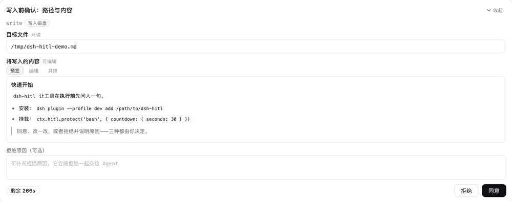
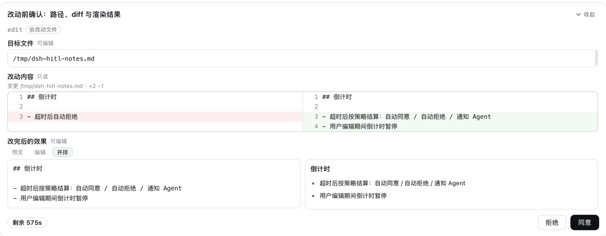
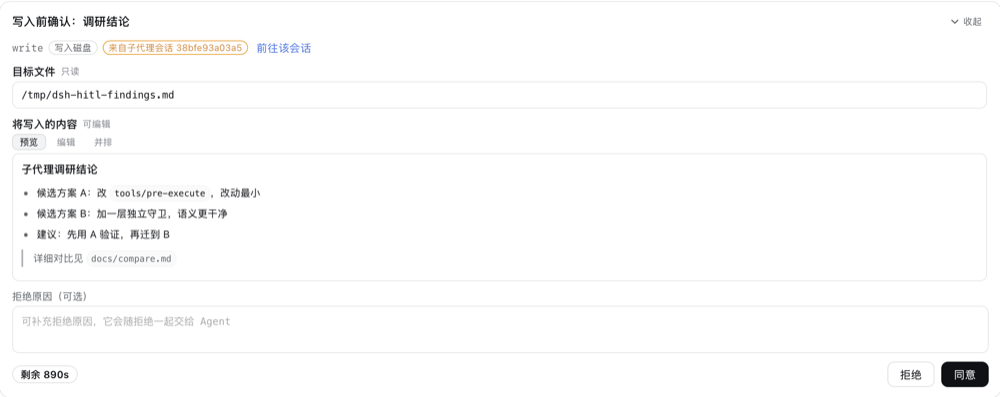
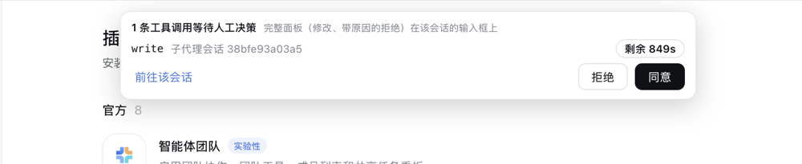

# dsh-hitl · 给任意工具挂上人工决策（Human-in-the-loop）

[English](README.md) | 中文

> **让 Agent 在动手之前，先问你一句。**
> 一行配置、一行 API，就能把任意工具调用变成一张等你点头的卡片：看清它要做什么，然后同意、改一改，或者拒绝并留下意见。

`dsh-hitl` 是 DeepSeek Harness (DSH) 的可安装插件（bundle）：**零依赖、零构建**——`index.js`（宿主半）+ `client.js`（浏览器半）+ `lib/`
全是可直接加载的纯 JS，装上刷新一次页面就能用。



## 主要功能

- **一句话挂载**：其他工具 / 插件用一行 API 或一行配置，把自己的工具挂进 HITL 流程；
- **执行前的决策卡**：工具真正运行之前，DSH Web 界面里出现 **标题 + 待决策提案 + 决策按钮**；
- **多种形式显示提案**：**左右分栏 diff（只读）**、**纯文本输入框**、**可编辑 + 可渲染的 markdown 输入框**；文本与 markdown 字段支持只读与编辑两种模式的呈现。
- **修改模式**：编辑过提案文本后，主按钮从【同意】变成【修改】——改动作为修订意见交回 Agent；
- **带反馈文本的拒绝**：【拒绝】可以带一个**反馈栏**，在反馈栏中写下的意见会随拒绝一起交给 Agent——它知道"不要做"，也知道"为什么不要做"；
- **支持倒计时配置**：可配置**倒计时**与三种结局（**自动同意 / 自动拒绝 / 把超时事件反馈给 Agent**）；



## 为DSH定制的适配

**子代理穿透：子代理里的工具调用也会触发主对话的批准请求。** 同进程子代理（`spawn` / `fork`）里的每一次工具调用都走同一道门禁——
请求会**同时**挂到"发起它的子会话"和"你正在看的会话"上：无论你在哪个对话里，卡片都支持弹出，并标着
「来自子代理会话 xxx」+【前往该会话】。
（跨进程后端不进这道门禁，见 §6.1。）



**不在对话界面上时，支持弹出迷你批准请求** 切到插件页、打开设置、甚至没选会话时，页面顶部会浮出一条提醒事项，减少用户不在对话页时HITL对流程的阻塞。
（条数、工具名、来源会话、剩余时间 +【同意】【拒绝】【前往该会话】）。



---

## 1. 安装

```sh
# 直接从 GitHub 装（无需构建）
dsh plugin --profile <你的 profile> add github:YunpengDon/dsh-hitl

# 目录方式（开发期最方便：改了代码重启 dsh 即可）
dsh plugin --profile <你的 profile> add /path/to/dsh-hitl

# 或用 GUI：设置 → 插件 → 安装 bundle
```

装上之后：

1. **刷新一次页面**（重要）。插件的令牌通过 index 注入到页面（`window.__DSH_HITL__`）。
   已经打开的页面即使被 HMR 热加载了客户端半，也拿不到这个注入值——所以第一次安装后必须刷新页面，
   之后的每次重启都不需要再刷。
2. 在 `cordis.patch.yml` 里给 `hitl` 这一行写上要保护的工具（见下一节），或让其他插件调用 `ctx.hitl.protect(...)`。

> 卸载：`dsh plugin --profile <profile> remove dsh-hitl`（会自动移除它带来的配置层）。

---

## 2. 三十秒上手

### 2.1 实现方案1:通过配置实现（不改目标工具代码）

`cordis.patch.yml`：

```yaml
- id: hitl
  name: 'dsh-hitl'
  config:
    protect:
      - tool: bash                      # 工具名；支持 'mcp__*' 这类通配
        title: 执行命令前确认            # 面板标题（粗体、自动换行）
        countdown: { seconds: 30, action: reject }
        reject: { feedback: true }      # 拒绝时显示反馈栏
```

> patch 覆盖某一行时替换的是**整份 config**：改这一行就要把所有键重述一遍。

### 2.2 实现方案2:在目标插件代码中挂载HITL

```js
export const name = 'my-plugin'
export const inject = ['hitl']            // 等 hitl 服务就绪后再 apply

export function apply(ctx) {
  // 第三个参数传自己的 ctx = 把挂载的生命周期绑到本插件
  ctx.hitl.protect('bash', {
    title: '这条命令要执行吗？',
    countdown: { seconds: 30, action: 'reject' },
    reject: { feedback: true },
  }, ctx)

  ctx.hitl.protect(['write', 'edit'], {   // 数组、通配、RegExp、函数谓词都可以
    title: '改动前确认',
    diff: { path: 'file_path', before: 'old_string', after: 'new_string' },  // 自动折成并排 diff
    countdown: null,                     // 不设倒计时 = 一直等（仍可被中断）
  }, ctx)
}
```

> **一定要带 `owner`（第三个参数）**：挂载是记在 `hitl` 插件里的状态，不是你的插件状态。
> 不传 owner 时，`protect()` 返回的 disposer 就是唯一的解绑手段——而"从 `apply` 里 return 一个函数"
> **不算生命周期**：实测过，插件行被卸载后挂载仍然生效，那个工具会被永久拦下去。
> 传了 `ctx` 之后，`hitl` 会在你的插件上下文上注册一个 effect，插件卸载即自动解绑。
> 另一种等价写法是把它包进你自己的 effect：
> `ctx.effect(() => ctx.hitl.protect('bash', {...}), 'my-plugin: hitl mount')`。
> 万一留下了残留挂载，用 `ctx.hitl.list()` 看一眼，`ctx.hitl.unprotect('bash')` 清掉；
> 或者把 `hitl` 这一行在插件页里关掉再打开（等价于重建插件状态）。

### 2.3 服务 API

| 成员 | 说明 |
|---|---|
| `protect(matcher, options?, owner?)` | 挂载一个工具；`owner` 传调用方 ctx 即可自动解绑；返回 disposer |
| `unprotect(matcher)` | 按 matcher 描述移除挂载，返回移除数量 |
| `list()` | 当前所有挂载（诊断用） |
| `pending()` | 当前所有等待人类决策的请求（诊断用） |

`matcher`：工具名 / 含 `*` 的通配串 / `RegExp` / 上面几者的数组 / `(exec) => boolean`。
同一个工具被挂载多次时，**后挂载的覆盖先挂载的**（配置行先注册，插件后注册，所以插件可以覆盖配置）。

---

## 3. 默认提案规则

不配置 `fields` 时，提案就是**本次调用的全部 parameters**：

- 字段标题 = `parameter` 的 key（工具 schema 里给了 `title` 就用 schema 的）；
- 字段值 = `parameter` 的 value，**统一用 markdown 输入框渲染**（非字符串值渲染成缩进 JSON 文本）；
- 可编辑性：`markdown` / `text` 默认可编辑，`diff` / `json` / `hidden` 永远只读；
- 参数为空对象或非对象时（例如只有一个标量参数），显示一个只读的 `(arguments)` 字段；
- 面板标题缺省为 `请确认 <toolName> 的执行方案`（跟随界面语言）。

---

## 4. 挂载选项（`protect()` 的第二个参数 / 配置行的每个条目）

| 键 | 类型 | 默认 | 说明 |
|---|---|---|---|
| `tool` / `matcher` | string \| RegExp \| array \| function | 必填 | 要保护的工具 |
| `title` | string | 见 §3 | 面板标题（粗体、自动换行） |
| `layout` | `stacked` \| `split` | `stacked` | 提案区排布：纵向堆叠 / 左右分栏 |
| `labels` | string[] | `[]` | 面板级标签（0 到多个） |
| `buttons` | `{approve?, modify?, reject?}` | 跟随语言 | 按钮文案覆盖 |
| `fields` | `FieldSpec[]` | 全部参数 | 要展示哪些参数、怎么展示 |
| `diff` | `{path?, before, after}` | 无 | 把两个参数折成一个并排只读 diff |
| `countdown` | `{seconds, action, freezeOnInteract?}` \| `null` \| `false` | `null` | 倒计时与超时行为；`null`/`false` = 不限时 |
| `reject.feedback` | boolean | `false` | 是否显示拒绝反馈栏 |
| `reject.feedbackPrompt` | string | 内置文案 | 反馈栏 placeholder |
| `reject.requireFeedback` | boolean | `false` | 反馈必填（为空时拒绝按钮会提示） |
| `modify.mode` | `revise-request` \| `allow-and-inform` | `revise-request` | 用户改了文本后点【修改】的语义，见 §5 |
| `whenUnavailable` | `reject` \| `wait` | `reject` | 没有任何浏览器连接时的行为（`reject` = fail-closed） |
| `enabled` | boolean \| `(exec) => boolean` | `true` | 临时关闭 / 条件挂载 |
| `maxFieldChars` | number | `20000` | 单字段渲染上限，超出会截断并提示 |

### FieldSpec

```js
{ param: 'content', title: '新内容', description: '会写入文件的内容',
  render: 'markdown',        // markdown | text | diff | json | hidden
  editable: true,            // 覆盖默认可编辑性
  labels: ['不可撤销'],       // 字段级标签
  diff: { before: 'old_string', after: 'new_string', path: 'file_path' } }   // render: 'diff' 时用
```

- `render` 缺省时：能配出 diff 就渲染 diff，否则渲染 markdown 输入框。
- `fields` 给定时**只显示**列出的字段（未列出的参数不会出现在面板里）。
- 配置行里可以简写成字符串：`fields: ['command', { param: 'cwd', title: '工作目录' }]`。

### 倒计时的三种结局

`countdown.action` 决定倒计时归零后宿主怎么判：

| action | 工具是否执行 | Agent 看到 |
|---|---|---|
| `approve` | 执行 | 无额外消息（工具正常返回） |
| `reject` | 不执行 | `Error: HITL: no human decision arrived within Ns, so tool "x" did not run (timeout policy: reject).` |
| `notify` | 不执行 | `Error: HITL: no human decision arrived within Ns, so tool "x" did not run. Tell the user this call timed out and wait for an explicit instruction before running it.` |

`freezeOnInteract`（默认 `true`）：用户一旦聚焦或编辑任何输入框，客户端会请求宿主**暂停倒计时**；
失焦即恢复。暂停有上限（插件配置 `holdGraceMs`，默认 5 分钟），防止关掉页面把工具永久卡住。

超时不是用户做的决定，所以面板**不会在归零瞬间消失**：它会停约 5 秒，倒计时 chip 转成「已超时，等待宿主处理」、
按钮与输入框置灰、底部显示「已按超时策略处理」，然后才收起——否则你只会看到卡片凭空不见了。
用户自己点的那三个按钮则是立刻收起（那是他自己按的）。

---

## 5. 决策语义（用户点了什么，Agent 收到什么）

| 用户动作 | 工具是否执行 | Agent 收到 |
|---|---|---|
| 【同意】 | 执行 | 工具正常结果 |
| 改了文本后【修改】（默认 `modify.mode: revise-request`） | **不执行** | `Error: HITL: the user revised the proposal, so tool "x" did not run. Re-issue the call with these changes:` + 每个改动字段的 `- param: 新文本` |
| 改了文本后【修改】（`allow-and-inform`） | 执行 | 工具正常结果 + 一条紧随其后的 user 消息，内容是用户改后的文本 |
| 【拒绝】 | 不执行 | `Error: HITL: the user rejected tool "x" and it did not run.`；填了反馈栏则是 `… User feedback: <原文>` |
| 倒计时 / 无决策端 / 请求被撤回 | 见 §4 与 §7 | 上表里的对应文案；撤回时返回的是 DSH 的规范取消结果 |

> **为什么【修改】默认不让工具执行？** DSH 目前不允许在执行前改写工具参数
> （`PreToolDecision` 只有 `allow` / `deny` / `cancel` / `ask`，改写参数仍是 proposed 状态的设计）。
> 所以「修改」是把用户改后的内容**交回 Agent**，让 Agent 用新参数重新发起调用——语义最诚实、日志也自洽。
> 如果你的工具本来就能接受"先执行、再被告知修改"（例如只是记录/展示类），把 `modify.mode` 设为 `allow-and-inform`。

所有拒绝/修改文案都带 `HITL:` 前缀，方便在会话记录里检索；错误码分别是
`HITL_REJECTED` / `HITL_REVISED` / `HITL_TIMEOUT` / `HITL_UNAVAILABLE`。

---

## 6. 面板行为

- **落点**：会话输入区（composer）座位，和 DSH 自带的审批面板、提问面板同一个位置——这是"agent 卡住等你决定"的既有位置。
- **折叠**：标题右侧的「收起 / 展开」按钮把**整个待决策提案**收起来，只留标题、倒计时和决策按钮（图标按"可收/可展"的方向：展开时 ∨、收起时 ∧），
  这样面板不会挡住上面的会话上下文。折叠是**会记住的**：收起一次，后面的请求也默认收起；
  折叠状态下按【拒绝】而该挂载配了反馈栏时，面板会先展开并把焦点放到反馈框，不会丢掉你的话。
- **优先级**：HITL 决策优先于审批/提问面板；同一会话里同时有多个待决策时，**最早的先显示**，面板右上角提示"另有 N 项待决策"。
- **倒计时**：位于**底部按钮行左侧**（和【拒绝】【同意】同一行，顶到最左），是一枚**醒目的 chip**（不是浅灰小字）：
  正常态实底 + 加粗等宽数字，剩余 ≤10 秒转为警示色并轻微脉动（遵循 `prefers-reduced-motion`），
  暂停态弱化样式，超时态错误色并显示「已超时，等待宿主处理」。归零后按钮禁用，
  面板再停留约 5 秒并写出「已按超时策略处理」，然后才收起。
- **倒计时永远是宿主的数字**：每一帧（新请求、重连 snapshot、client 模块热重载后的重发）携带的都是
  宿主**当下**算出的剩余时间（宿主半的 `liveRequest()` 投影 + 前端每次收到都重新基准化时钟）。
  所以刷新页面、切标签页、热重载都不会让倒计时"退回满值"，也不会出现
  「界面还剩 10 秒、宿主已经判超时」的错位。
- **交互即暂停**：聚焦/编辑任何输入框时客户端向宿主申请**冻结倒计时**，宿主同意后才显示「已暂停（交互中）」——
  显示与宿主时钟一致，剩余时间真的停住；失焦即恢复，并受 `holdGraceMs`（默认 5 分钟）上限保护。
  重连后宿主下发的 snapshot 会带上 `countdown.held`，暂停状态不会因为刷新而假装还在暂停。
- **markdown 字段**：**默认停在【预览】**（决策面板先给人看结果，源码是次一级的信息），
  `预览 / 编辑 / 并排` 三个视图可切换。渲染器是本插件自带的受控子集
  （标题、列表、引用、围栏代码、行内代码、粗斜体、链接、分割线、段落），
  行内代码与配色对齐宿主 markdown（沿用 `--dsw-alias-markdown-inline-code`、`--ds-font-family-code`）。
  **先转义再生成标签**，源文本里的 HTML 不会变成标签；`javascript:` 之类的链接目标会被丢弃。
- **字段头说的就是控件现在能做到的事**：字段标题旁的小字标「可编辑 / 只读」，它由**和渲染区同一个判断**得出
  （`isFieldEditable`）——字段自己说 `editable: true`，但面板正在提交 / 已提交 / 已超时时，渲染区已经变成只读块，
  小字也同步变成「只读」，不会出现"标着可编辑、点不动"的状态。
- **只读字段**：`editable: false` 的字段**不会**渲染成可输入控件——`text` 渲染成块状只读区，
  `markdown` 只保留 `预览 / 并排` 且**页签里没有【编辑】**，标题旁标「只读」。
  【并排】左边的源码窗格是**块状只读区（可选中、可复制）**，不是 `disabled` 的输入框——
  浏览器里 disabled 框里的字既选不中也复制不了，那等于把内容摆出来又不让人拿走。
- **输入框自适应**：单行内容只占一行高，随内容长高，到 320px 封顶后框内滚动；从不在面板里铺满一大片空白。
  增高发生在**绘制之前**（layout effect），否则会有一帧"1 行高"把提案区撑矮、被浏览器把滚动位置夹回顶部。
- **切视图不丢位置**：点【编辑】/【预览】/【并排】会保留提案区当前的滚动锚点（切换前记录、绘制前还原），
  长提案在中间切换视图不会跳回顶部。
- **diff 字段**：左右分栏、只读、行号对齐，新增/删除分别用 `--dsw-alias-code-diff-added` / `-deleted` 着色；
  任一侧超过 2000 行时不做对齐，改为左右原文对照并提示。
- **多窗口**：所有打开的标签页都会收到同一请求；**先决策者生效**，其他标签页收到 settled 帧后自动收起面板。
- **刷新/断线**：页面重连后宿主会下发一次 snapshot，待决策项重新出现，不会丢。
- **样式**：只用 DSH 主题令牌（`--dsw-alias-*`），跟随明暗主题；面板自带 error boundary，出错时降级成一行提示而不是把输入区弄白。

### 6.1 子代理（subagent）调用的落点

子代理调用的工具**同样会被拦**（同进程子代理，见下表），但那一次调用发生在**子会话**里，
而 DSH 的待决策值是**按会话归属**的：只有"你正在看的那个会话"有请求，面板才会接管它的输入区。
所以本插件给每个请求做**两份归属**：

| 归属 | 作用 |
|---|---|
| 发起调用的会话 | 你点进那个子代理会话（对话里的子代理卡片 → 打开子会话）时，面板就在那里 |
| **你当前正在看的会话** | 无论你在看哪个会话，面板都出现在你眼前的输入区；标题行标出「来自子代理会话 4e05464d5b7d」并给一个【前往该会话】 |

- 两份归属是**同一个请求**：在哪一处决策都结算同一次调用，先答的先算；面板里的「另有 N 项待决策」按全部待决策计算。
- 你切换会话时，这份"跟随"归属会自动迁移（客户端订阅宿主的 main-view 绑定源），不需要刷新页面。
- 为什么必须做：DSH 侧栏那一行的状态点只认内置的 `approval / plan-review / question` 三种种类，
  本插件的 `kind: 'hitl'` 不在其中，所以**子会话那一行不会有任何红点**；
  没有"跟随"归属时，一个子代理的挂载调用会静默等到倒计时结束。

**会触发吗？**（在本机 profile 实测过一次，2026-04）

| 子代理后端 | 是否触发 | 说明 |
|---|---|---|
| `spawn` / `fork`（同进程，`subagent-in-process-driver`） | **会** | 子代理就是同进程里的另一个 agent，工具流水线是同一条；本插件的监听器没有 agent 作用域标签，按 `scopeTarget` 的规则"未打标签的监听器一律放行" |
| `dsh-sdk` / `acp` / `claude-code` / `codex`（跨进程） | **不会** | 它们的工具调用在**另一个进程**里发生，根本不经过 DSH 的 `tools/pre-execute`；只有 `subagent` 这个**调用本身**能被挂载拦住 |

**触发之后会发生什么**：子代理那一次调用停在门禁上（它的 turn 卡住），父代理的 `subagent` 调用在等子代理，
于是**整轮对话一起停**——你在界面上看到的可能只是"子代理还在跑"。
等待期间可以在面板上作答；超时按该挂载的 `countdown.action` 结算，子代理会收到一条工具错误，形如

```
Error: HITL: no human decision arrived within 75s, so tool "glob" did not run. Tell the user this call timed out and wait for an explicit instruction before running it.
```

（事件里带 `error: {name:'HitlTimeout', code:'HITL_TIMEOUT'}`），之后由它自己决定汇报还是重试。
**建议给可能被子代理调用的挂载配 `countdown`**：没有倒计时就是无限等，而子代理那边没有人会替你点。

### 6.2 帧级兜底提示（`shell.overlay`）

输入区座位并不是"挂载了就能被看到"：没选会话、主面板切到了插件页、被更高优先级的宿主面板占用、
**或者被一个全屏模态盖住**（设置面板就是：它是一个 `z-index:1000` 的 body portal，
而对话和输入区**仍然挂在后面**，并没有卸载）——这些情况下请求都需要另一个落点。
本插件另外注册了一个 **root 作用域的浮层**（`shell.overlay` 里的 `dsh-hitl.notice`，加法式注册，不替换任何内置条目）：

- 出现条件 = 有可决策的请求，**且**（没有输入区座位 **或** 座位上的面板已经够不着了）。
  "够不着"由面板自己**每秒做一次命中测试**得出（`document.elementFromPoint` 打到面板之外 = 被盖住/被裁剪/滚出视口），
  而不是靠猜会话状态；面板一旦真的在眼前，浮层立刻让位，绝不双份显示。
- **能被盖住也看得见**：浮层会用 `popover="manual"` + `showPopover()` 提升到浏览器的 **top layer**，
  于是 `z-index:1000` 的模态也压不住它（不支持该 API 的环境退化成 shell 浮层里的固定定位，此时模态仍会盖住它）。
- 显示条数、工具名、来源（本会话 / 子代理会话）和宿主倒计时；最多列 3 条，其余收成「另有 N 条」。
- 直接提供【同意】【拒绝】这两条不需要编辑的路径 +【前往该会话】；
  「修改」和带原因的拒绝仍然在会话面板里做。
- 自身包在 error boundary 里，且 failure 时**渲染 null**：一个盖在全帧上的组件坏掉时必须消失，而不是留一个空盒子。

### 6.3 界面语言

面板跟随**应用当前语言**，不是"跟着挂载方"也不是"写死中文"：

- **当前语言从哪来**：先看用户在 设置 → 通用 → 语言 里的选择（持久化在 DSH 设置里，跨浏览器生效）；
  没选过就看浏览器——`navigator.languages` 里第一个能匹配**已注册语言**的标签（先整串匹配，再退回主语言标签，
  所以 `zh-CN`、`zh-TW`、`zh-Hans` 都命中 `zh`），都不匹配就用 **English**（DSH 的 `FALLBACK_LOCALE`，
  理由是"没点名任何已注册语言的读者最不可能读中文"）。所以：**中文浏览器→中文面板，其它语言（日/德/法/…）→英文面板。**
- **键级回退链**：当前语言字典 → 各语言的 `fallback`（语言包声明）→ `en` → 公共命名空间 → 最后才是**键名本身**。
  本插件的 zh / en 字典**键集完全一致**（有测试锁住），所以不会漏出键名；
  即使装了第三种语言包（界面本身变成日文等），本插件的文案也会落到**英文**，而不是显示 `label.countdown` 这种东西。
- **切换语言立即生效**，不需要刷新页面（slot 的 locale 绑定与字典注册都会推进 revision，已渲染的座位会重取文案）。
- **插件列表里的名字/简介**走 DSH 的另一条通道：包里的 `locale/<语言>.json`，形状必须是
  `{"meta":{"title":…,"description":…}}`，且 `exports` 里要有 `./locale/*.json`、`files` 里要有 `locale`。
  缺任一项，卡片标题就静默退回包名 `dsh-hitl`（本仓库有测试盯着这件事）。
- **不会被本地化的东西**：`protect()` 的 `title`、`labels`、字段 `title`/`description`（那是挂载方自己的文案）、
  工具名，以及提案里的**参数原文**。想给中英双语标题，目前只能由挂载方按语言分别传字符串。
- **宿主半给模型看的文本固定英文**（拒绝理由、超时提示、修订说明），与 DSH 其它执行前策略一致——
  它进的是模型的上下文，不是人的界面。

---

## 7. 安全模型与失败关闭

- 面板与宿主之间是**本插件自己的一条同源 HTTP 通道**：`GET <endpoint>/events`（SSE 下行，连接即收 snapshot）
  + `POST <endpoint>/decide`（JSON 上行）。默认 `endpoint = /dsh-hitl`。
- 通道由**每进程一个随机令牌**保护：令牌通过 DSH 的结构化 index 注入行
  （`webserver/index-inject` 的 `{kind:'global'}`）写进页面 `window.__DSH_HITL__`，不写日志、不落盘。
- 服务端还会校验：来源必须是回环地址；POST 必须带 `content-type: application/json` 与
  `Origin`（有的话）与 Host 同源；请求体上限 256 KiB；令牌比较用 `timingSafeEqual`。
  这些检查挡的是"本机别的网页"（CSRF / DNS rebinding），不是本机进程——本机进程本来就能读 `~/.dsh`。
- **没有任何浏览器连接时默认 fail-closed**：挂载在 HITL 上的工具会被拒绝，
  模型看到 `Error: HITL: no browser is connected to decide, so tool "x" did not run (fail-closed).`。
  想让它在无人值守时一直等，把 `whenUnavailable` 设为 `wait`。
- 插件在没有任何 Web 服务的组合里（headless/TUI）**仍然激活并继续拦**——"没有 UI 就不拦"不是本插件的语义。

---

## 8. 与其他执行前策略的关系

- 本插件用 `tools/pre-execute` 且 `prepend: true`，也就是**先问人**；用户同意后，
  沙箱、guard、hooks、审批等其它策略照常随后生效。**用户的同意不等于越权**。
- 因此可能出现"用户同意了，但工具仍被沙箱/守卫拒绝"——这是设计使然，不是 bug。
- 本插件只做"执行前问人"，不改变工具参数、不改变工具结果。

---

## 9. 已知限制

- **不能改写工具参数**（见 §5），所以【修改】默认走"拒绝并交回修改内容"。
- **挂载文案不本地化**：`title` / `labels` / 字段标题都是挂载方给的字符串，本插件不翻译，也不接受 `{zh, en}` 映射（见 §6.3）。
- **不写会话审计事件**：DSH 不允许插件追加新的事件类型，决策痕迹只存在于工具结果（和 `allow-and-inform` 的那条 user 消息）里。
- **只有 Web 界面有面板**：ACP/TUI/headless 下按 `whenUnavailable` 处理（默认拒绝）。
- **只支持 Web 界面同源部署**（页面与插件路由同一个 `dsh web` 地址）；Desktop 的 worker 形态未验证。
- `allow-and-inform` 模式下的那条 user 消息是按 `createUserMessage` 的形状手工构造的
  （`{id, role:'user', source:{kind:'user'}, content}`），因为纯 JS 插件不能 import 宿主工厂。
- 面板不注册全局快捷键（避免抢宿主 Enter/Esc）；请用鼠标点按钮。
- **跨进程子代理不受本插件管辖**（见 §6.1）：`dsh-sdk` / `acp` / `claude-code` / `codex` 后端里的工具调用不经过
  `tools/pre-execute`，只有 `subagent` 调用本身能被挂载拦住。
- **帧级浮层不是完整面板**：它只能【同意】/【拒绝】（不带原因），「修改」和「带原因的拒绝」需要在会话面板里做。
- **子代理请求会让父代理一起等**：这不是本插件能改的——父代理在等子代理返回，子代理在等你的决策。

---

## 10. 故障排查

| 症状 | 原因 / 处理 |
|---|---|
| 工具直接被拒绝，提示 `no browser is connected to decide` | 页面没连上决策通道：装完插件后**刷新一次页面**；确认浏览器控制台没有 401 |
| 面板一直不出现，工具一直卡着 | 该请求的会话不是你当前正在看的会话。本插件会把请求同时挂到你正在看的会话上（§6.1），所以正常情况下不会发生；真的没出现时，看帧级浮层（§6.2），或切到发起会话 |
| 子代理的调用没人管 / 子代理卡住整轮对话 | 预期行为：同进程子代理的调用会真的拦下来，父代理一起等（§6.1）。给它配 `countdown`，或在面板/浮层上作答 |
| 跨进程子代理里的工具完全不拦 | 预期行为（§6.1）：那些工具在别的进程里跑，不经过 `tools/pre-execute` |
| 侧栏子会话那一行没有红点 | 预期行为：DSH 的侧栏状态点是编译期闭集（`approval/plan-review/question`），本插件的 `kind: 'hitl'` 不在其中。用输入区面板或帧级浮层 |
| `countdown` 不生效 | 检查 `seconds` 是正整数、`action` 是三个取值之一；非法配置会在宿主日志里给出 `dsh-hitl:` 警告并退化成"不限时" |
| 改了配置没反应 | patch 覆盖是**整份 config 替换**；确认 `id: hitl` 这一行的 config 完整 |
| 装了插件但宿主半没起来 | 看 dsh 的 stderr：行加载失败不会让 dsh 退出，日志里会出现 `dsh-hitl: ...` 或行 id 的报错 |
| 升级插件版本后行为没变 | 替换已安装包需要**重启 dsh**（插件管理器不会让新版本就地生效） |
| 改了插件代码但行为没变 | **浏览器半**（`client.js`）会被客户端热重载自动拾取；**宿主半**（`index.js`、`lib/`）受 Node 的 ESM 模块缓存影响，`禁用→启用` 这一行**不会**重新加载代码，必须**重启 dsh** |
| 想一眼看清宿主状态 | `curl -s http://127.0.0.1:3081/dsh-hitl/status`（仅回环、无需令牌、只读）：返回当前连接的浏览器数、本进程签发过的令牌数、正在挂载的工具、以及待决策列表（含实时剩余毫秒与是否暂停）。它不含令牌、不含任何工具参数 |

宿主半的诊断日志统一带 `dsh-hitl:` 前缀（非法挂载、丢连接、通道拒绝等）。

---

## 附录 · 协议（想自己写 UI 的话）

下行（SSE，`data: <json>`）：

```jsonc
{ "type": "snapshot", "version": 1, "requests": [Request, ...] }   // 连接即发
{ "type": "request", "version": 1, "request": Request }            // 新的待决策
{ "type": "settled", "version": 1, "id", "outcome": "user|timeout|abort|host" }
{ "type": "holdAck", "version": 1, "id", "held": true, "expiresAt": 1712 }
```

`Request`：

```jsonc
{ "id", "sessionId", "toolName", "callId?", "title?", "layout", "labels": [],
  "fields": [ { "param", "title", "description?", "render", "editable", "labels": [],
                "value"?, "truncated"?, "diff"? { "path?", "oldText", "newText" } } ],
  "buttons": { "approve"?, "modify"?, "reject"?, "feedback": { "enabled", "prompt"?, "required" } },
  "countdown": { "remainingMs", "action", "freezeOnInteract" } | null,
  "createdAt" }
```

上行（`POST <endpoint>/decide`，`Authorization: Bearer <token>`）：

```jsonc
{ "type": "decide", "id", "decision": { "kind": "approve" } }
{ "type": "decide", "id", "decision": { "kind": "modify", "fields": [{ "param", "text" }] } }
{ "type": "decide", "id", "decision": { "kind": "reject", "feedback"?, } }
{ "type": "hold",   "id", "held": true }
```

应答：`{ ok: true, accepted: true, held?, expiresAt? }` 或
`{ ok: false, code: "unauthorized|bad-payload|unknown-request|already-settled|host-gone", message }`。

---

## 附录 · 文件结构

```text
dsh-hitl/
├── index.js                629   宿主半：服务 + 门禁 + 倒计时/持握 + SSE/决策路由 + 令牌注入
├── client.js              1918   浏览器半：决策面板 + 帧级浮层（自包含 classic script，无 import）
├── lib/                          宿主半的纯逻辑：不碰 Cordis、不碰 DOM，可单独跑测试
│   ├── protocol.js         182   帧与上行校验、上限、错误码（协议规范的唯一出处）
│   ├── resolve.js          302   matcher 编译（名字/通配/RegExp/谓词）、挂载选项归一化与诊断
│   ├── fields.js           244   默认提案推导、diff 配对、决策 → 模型可见文本
│   └── pending.js          217   待决策状态机（可注入时钟）：倒计时、持握、恰好一次的结算
├── locale/                       插件列表里的名字与简介（形状必须是 {"meta":{...}}，见 §6.3）
│   ├── en.json               6
│   └── zh.json               6
├── docs/                         上文那些截图，中英各一套（-cn / -en）
├── tests/                        零依赖 Node 测试，共 151 个用例
│   ├── client.test.js      818   （65）浏览器半的纯函数 + store / connection / seat
│   ├── fields.test.js      269   （26）提案推导与决策文本
│   ├── pending.test.js     240   （18）状态机（注入时钟，无真实等待）
│   ├── resolve.test.js     162   （18）matcher 与选项归一化
│   ├── protocol.test.js    117   （16）帧与上行校验
│   ├── docs.test.js        116   （5）两份 README、互链，以及上面这张表里的每个数字
│   └── manifest.test.js     61   （3）包元数据与 locale 资源形状
├── package.json             69   清单：exports / dsh.bundle.patch / dsh.client / icon
├── cordis.patch.yml         17   bundle 的配置层（插入 id 为 hitl 的那一行）
├── icon.svg                  6   插件列表图标
├── README.md                     本文档（英文版）
└── README.zh.md                  本文档的中文版
```

**改哪个文件，怎么生效**（和 §10 的排错表是同一条规则）：

| 文件 | 属于哪一半 | 改动如何生效 |
|---|---|---|
| `index.js`、`lib/*.js` | 宿主半（Node） | 必须**重启 dsh**。Node 的 ESM 模块缓存不会因为"禁用→启用这一行"而失效 |
| `client.js` | 浏览器半 | **客户端热重载**自动拾取（宿主每 500ms stat 一次各行的 client 产物并广播 `/plugins/events`），不用刷新页面 |
| `locale/*.json` | 插件列表元数据 | 插件管理器重读元数据时生效（打开插件页 / 重启 dsh） |
| `docs/*.png` | 文档 | README 渲染时 |
| `package.json`、`cordis.patch.yml` | 清单与配置层 | 需要重启或重新加载该行；已安装包不会被就地替换 |
| `tests/*.js` | 开发期 | 不参与运行，只由 `npm test` / `node --test` 执行 |

**为什么长这样**（三条约束，改代码前先看）：

- `client.js` **必须**是一个自包含的 classic script。DSH 把它原样作为 `/plugins/dsh-hitl/client.js` 提供给浏览器，
  入口固定是 `window.__ModuleLoader__.load({ id, factory(require) })`，只能从模块表里取 `react`，
  **不能** import 任何 `@deepseek-ai/*` 客户端包（没有打包步骤会替你解析它们）。
  所以 markdown 渲染器、并排 diff、倒计时、面板样式全部写在这一个文件里，CSS 只用 `--dsw-*` 主题令牌。
- `lib/` 是宿主半专用的纯模块。浏览器半**不能** require 它们，宿主半也不在其中引入 Cordis 或 HTTP——
  这样每个模块都能被 `node --test` 直接跑，协议/状态机的行为不依赖运行时。
- `client.js` 的纯逻辑通过工厂返回值的 `__test` 暴露给测试：`tests/client.test.js` 用桩
  `window.__ModuleLoader__` + 桩 React 加载**真实的** `client.js`，所以浏览器半的逻辑改动同样有回归保护
  （markdown 渲染、diff、时钟、落点归属、座位可见性都在里面）。

---

## 开发与自测

```sh
node --check index.js client.js lib/*.js     # 语法
npm test                                     # 151 个纯函数/状态机/通道用例，零依赖
npm run check                                # 上面两步合起来（语法 + 全部用例）
```

每个文件的作用、行数、以及"改它之后要不要重启 dsh"见上面的
**附录 · 文件结构**（目录不在下面重复第二遍，避免两处描述走偏）。

本插件的宿主半与浏览器半的约定以 `lib/protocol.js` + `tests/protocol.test.js` 为准。
